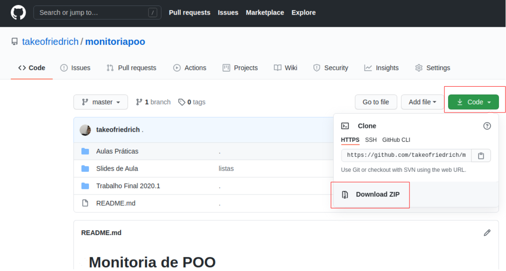

# Monitoria de POO

Aulas e Listas de Exercícios da Monitoria da Disciplina de Programação Orientada a Objetos (POO) da Universidade do Estado de Santa Catarina (UDESC). Materiais elaborados sob a orientação do professor Fabiano Baldo.

## Contato

 

 

## Conteúdos

1. Aulas Práticas
    - [Aula Pratica 1][a1]: Entrada e Saida Padrão em Java
    - [Aula Prática 2][a2]: Conceitos Básicos de Orientação a Objetos
    - [Aula Prática 3][a3]: Introdução a UML - Diagrama de Classes
    - [Aula Prática 4][a4]: Herança
    - [Aula Prática 5][a5]: Coleções
    - [Aula Prática 6][a6]: Classes Abstratas
    - [Aula Prática 7][a7]: Interface
    - [Aula Prática 8][a8]: Entrada e Saída de Dados com Arquivos
    - [Aula Prática 9][a9]: Tratamento de Exceções
    - [Aula Prática 10][a10]: Criação de Esquema de Banco de Dados
    - [Aula Prática 11][a11]: Persistência em Banco de Dados e DAO
    - [Aula Prática 12][a12]: Interface Gráfica I
    - [Aula Prática 12][a122]: Interface Gráfica II

2. Resumo de Aulas
    - [Resumo][r1]: Diagramas de Classes UML em Java
    - [Resumo][r2]: Padrões de Projetos em Java
    - [Resumo][r3]: Interface Gráfica em Java
    - [Resumo][r4]: Persistência de Dados Utilizando PostgreSQL

3. Trabalho Final 2020.1
    - [Trabalho Final 2020.1][tf]: Exemplo do Trabalho Final da Disciplina implementado pelo aluno Victor Eduardo Requia:

    

## Baixando os arquivos

### Pasta compactada

### Utilizando o git

Com o git instalado em seu computador, execute o comando:

    git clone https://github.com/monitoriapoo

## Conteúdos disponíveis

- ### Aulas Práticas

    - #### Aula Prática 1: Entrada e Saída Padrão em Java - [ir para o projeto][ap1]
    Revisão de conceitos básicos de programação estruturada, tais como: estruturas de repetição, estruturas de condição, etc. Familiarização com a linguagem Java e com o ambiente de desenvolvimento a ser utilizado nas aulas. Entrada e Saída de dados via console. 
    - #### Aula Prática 2: Conceitos Básicos de Orientação a Objetos - [ir para o projeto][ap2] 
    Criando classes e objetos e utilizando encapsulamento para definir os atributos do objetos através de métodos getters e setters.
    - #### Aula Prática 3: Introdução a UML - Diagrama de Classes - [ir para o projeto][ap3]
    Utilizando UML para representar classes, métodos, atributos e relacionamentos entre as classes. Implementando um diagrama de classes utilizando a linguagem orientada a objetos Java.
    - #### Aula Prática 4: Herança - [ir para o projeto][ap4]
    Criando classes que estendem recursos de outras e sobreescrevendo métodos. Utilização de polimorfismo.
    - #### Aula Prática 5: Coleções - [ir para o projeto][ap5]
    Utilizando o framework coleções para manipular agrupamento de objetos. Realizando operações de adicionar, remover, buscar, etc. 
    - #### Aula Prática 6: Classes Abstratas - [ir para o projeto][ap6]
    Criando classes que não podem ser instânciadas, mas ditam o que outras classes que irão estendê-la devem fazer.
    - #### Aula Prática 7: Interface  - [ir para o projeto][ap7]
    Escrevendo interfaces dos quais as classes que desejem implementá-la, devam criar suas próprias implementações desses métodos. Utilização de polimorfismo.
    - #### Aula Prática 8: Entrada e Saída de Dados com Arquivos - [ir para o projeto][ap8]
    Utilizando arquivos externos para persistir os dados manipulados pelo programa. Seguindo um padrão para inserir, remover e buscar as informações do arquivo.
    - #### Aula Prática 9: Tratamento de Exceções - [ir para o projeto][ap9]
    Fazendo o tratamento de situações que podem ocorrer dentro da execução do programa, mas que não pertencem ao fluxo normal.
    - #### Aula Prática 10: Criação de Esquema de Banco de Dados - [ir para o projeto][ap10]
    Tranformando objetos e classes em tabelas e tuplas. Persistindo esses objetos utilizando o banco de dados PostgreSQL.
    - #### Aula Prática 11: DAO e Persistência em Banco de Dados - [ir para o projeto][ap11]
    Fazendo o mapeamento das classes do sistema para um banco de dados relacional. Utilizando PostgreSQL e JDBC para persistir os dados no banco.
    - #### Aula Prática 12: Interface Gráfica I - [ir para o projeto][ap12]
    Criando interfaces gráficas interativas com o usuário.
    - #### Aula Prática 12: Interface Gráfica II - [ir para o projeto][ap122]
    Continuação da aula anterior.

- ### Resumos de Aulas

    - #### Diagramas de Classes UML em Java - [ir para o pdf][rs1]
    Representando classes, atributos e métodos. Pacotes e interfaces. Relacionamentos, funções e cardinalidade.
    
    - #### Padrões de Projetos em Java - [ir para o pdf][rs2]
    Como aplicar alguns dos padrões de projetos do GoF utilizando a linguagem Java.
    
    - #### Interface Gráfica em Java - [ir para o pdf][rs3]
    Criando caixas de texto, botões, tabelas, menus, etc. utilizando Java.
    
    - #### Persistência de Dados Utilizando PostgreSQL - [ir para o pdf][rs4]
    Como tranformar uma classe em tabelas e relacionamentos entre elas. Criando um banco de dados utilizando o PostgreSQL. Manipulando tabelas para inserção, remoção, busca e atualização de objetos no banco.

- ### Trabalho Final 2020.1

    #### Exemplo do Trabalho Final da Disciplina 

    A pasta referenciada contém o código-fonte e os arquivos referentes ao trabalho final da disciplina no semestre 2020.1, implementado pelo aluno **Victor Eduardo Requia**. A proposta do trabalho era criar um sistema de hospital com persistência de dados utilizando o PostgreSQL e uma interface gráfica em Java.

    O enunciado e alguns arquivos pertinentes ao banco disponibilizado aos alunos, encontra-se nesse [link][tfL].

[a1]:https://github.com/takeofriedrich/monitoriapoo#aula-pr%C3%A1tica-1-entrada-e-sa%C3%ADda-padr%C3%A3o-em-java---ir-para-o-projeto
[ap1]:https://github.com/takeofriedrich/monitoriapoo/tree/master/Aulas%20Práticas/Aula%20Prática%201%20-%20Entrada%20e%20Saída%20Padrão%20em%20Java
[a2]:https://github.com/takeofriedrich/monitoriapoo#aula-pr%C3%A1tica-2-conceitos-b%C3%A1sicos-de-orienta%C3%A7%C3%A3o-a-objetos---ir-para-o-projeto
[ap2]:https://github.com/takeofriedrich/monitoriapoo/tree/master/Aulas%20Práticas/Aula%20Prática%202%20-%20Classes%20e%20Objetos
[a3]:https://github.com/takeofriedrich/monitoriapoo#aula-pr%C3%A1tica-3-introdu%C3%A7%C3%A3o-a-uml---diagrama-de-classes---ir-para-o-projeto
[ap3]:https://github.com/takeofriedrich/monitoriapoo/tree/master/Aulas%20Práticas/Aula%20Prática%203%20-%20Introducao%20a%20UML
[a4]:https://github.com/takeofriedrich/monitoriapoo#aula-pr%C3%A1tica-4-heran%C3%A7a---ir-para-o-projeto
[ap4]:https://github.com/takeofriedrich/monitoriapoo/tree/master/Aulas%20Práticas/Aula%20Prática%204%20-%20Implementação%20de%20Herança%20em%20Java
[a5]:https://github.com/takeofriedrich/monitoriapoo#aula-pr%C3%A1tica-5-cole%C3%A7%C3%B5es---ir-para-o-projeto
[ap5]:https://github.com/takeofriedrich/monitoriapoo/tree/master/Aulas%20Práticas/Aula%20Prática%205%20-%20Utilização%20de%20Coleções%20em%20Java
[a6]:https://github.com/takeofriedrich/monitoriapoo#aula-pr%C3%A1tica-6-classes-abstratas---ir-para-o-projeto
[ap6]:https://github.com/takeofriedrich/monitoriapoo/tree/master/Aulas%20Práticas/Aula%20Prática%206%20-%20Classes%20Abstratas%20em%20Java
[a7]:https://github.com/takeofriedrich/monitoriapoo#aula-pr%C3%A1tica-7-interface----ir-para-o-projeto
[ap7]:https://github.com/takeofriedrich/monitoriapoo/tree/master/Aulas%20Práticas/Aula%20Prática%207%20-%20Interface%20em%20Java
[a8]:https://github.com/takeofriedrich/monitoriapoo#aula-pr%C3%A1tica-8-entrada-e-sa%C3%ADda-de-dados-com-arquivos---ir-para-o-projeto
[ap8]:https://github.com/takeofriedrich/monitoriapoo/tree/master/Aulas%20Práticas/Aula%20Prática%208%20-%20Entrada%20e%20Saida%20em%20Arquivos
[a9]:https://github.com/takeofriedrich/monitoriapoo#aula-pr%C3%A1tica-9-tratamento-de-exce%C3%A7%C3%B5es---ir-para-o-projeto
[ap9]:https://github.com/takeofriedrich/monitoriapoo/tree/master/Aulas%20Práticas/Aula%20Prática%209%20-%20Tratamento%20de%20Exceções%20em%20Java
[a10]: https://github.com/takeofriedrich/monitoriapoo#aula-pr%C3%A1tica-10-cria%C3%A7%C3%A3o-de-esquema-de-banco-de-dados---ir-para-o-projeto
[ap10]:https://github.com/takeofriedrich/monitoriapoo/tree/master/Aulas%20Práticas/Aula%20Prática%2010%20-%20Criação%20de%20Esquema%20de%20Banco%20de%20Dados
[a11]:https://github.com/takeofriedrich/monitoriapoo#aula-pr%C3%A1tica-11-dao-e-persist%C3%AAncia-em-banco-de-dados---ir-para-o-projeto
[ap11]:https://github.com/takeofriedrich/monitoriapoo/tree/master/Aulas%20Práticas/Aula%20Prática%2011%20-%20Persistência%20em%20Banco%20de%20Dados%20e%20DAO
[a12]:https://github.com/takeofriedrich/monitoriapoo#aula-pr%C3%A1tica-12-interface-gr%C3%A1fica-i---ir-para-o-projeto
[ap12]:https://github.com/takeofriedrich/monitoriapoo/tree/master/Aulas%20Práticas/Aula%20Prática%2012%20-%20Interface%20Gráfica%20I
[a122]:https://github.com/takeofriedrich/monitoriapoo#aula-pr%C3%A1tica-12-interface-gr%C3%A1fica-ii---ir-para-o-projeto
[ap122]:https://github.com/takeofriedrich/monitoriapoo/tree/master/Aulas%20Práticas/Aula%20Prática%2012%20-%20Interface%20Gráfica%20em%20Java%20II
[r1]:https://github.com/takeofriedrich/monitoriapoo#diagramas-de-classes-uml-em-java---ir-para-o-pdf
[rs1]:https://github.com/takeofriedrich/monitoriapoo/blob/master/Slides%20de%20Aula/Introducao%20a%20UML.pdf
[r2]:https://github.com/takeofriedrich/monitoriapoo#padr%C3%B5es-de-projetos-em-java---ir-para-o-pdf
[rs2]:https://github.com/takeofriedrich/monitoriapoo/blob/master/Slides%20de%20Aula/Padrões%20de%20Projetos.pdf
[r3]:https://github.com/takeofriedrich/monitoriapoo#interface-gr%C3%A1fica-em-java---ir-para-o-pdf
[rs3]:https://github.com/takeofriedrich/monitoriapoo/blob/master/Slides%20de%20Aula/Interface%20Gráfica.pdf
[r4]:https://github.com/takeofriedrich/monitoriapoo#persist%C3%AAncia-de-dados-utilizando-postgresql---ir-para-o-pdf
[rs4]:https://github.com/takeofriedrich/monitoriapoo/blob/master/Slides%20de%20Aula/Persistência%20de%20Dados%20Utilizando%20PostgreSQL.pdf
[tf]:https://github.com/takeofriedrich/monitoriapoo#trabalho-final-20201
[tfl]:https://github.com/takeofriedrich/monitoriapoo/tree/master/Trabalho%20Final%202020.1
